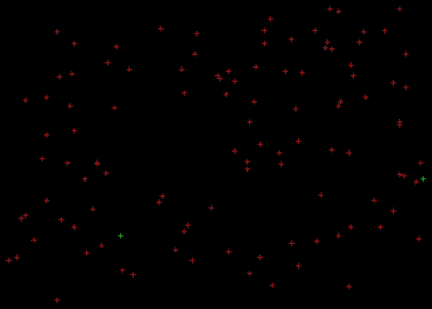

# Travelling-Salesman-Problem

Travelling salesman problem solver using genetic programming in C++

## Dependencies

* SDL 2
* JSON for Modern C++
* TCLAP

## Usage

* Compilation : `make`

* Run : `./tsp  {-r <int>|-f <path>} -o <path>`
	* -r <int> : Solve the problem on a random map with the specified number of cities
	* -f <path> : Solve the problem on the JSON representation of the specified map
	* -o <path> : Output file name for the solution path
	* Examples :
	    * `./tsp -o data/solution/path.json -r 150` : Compute the solution on a random map of 150 cities and save the solution in `data/solution/path.json`
	    * `./tsp -n data/solution/path.json -f data/map/map.json` : Compute the solution on the map contained in the file `data/map/map.json` and save the solution in `data/solution/path.json`

* Delete binaries : `make clean`

